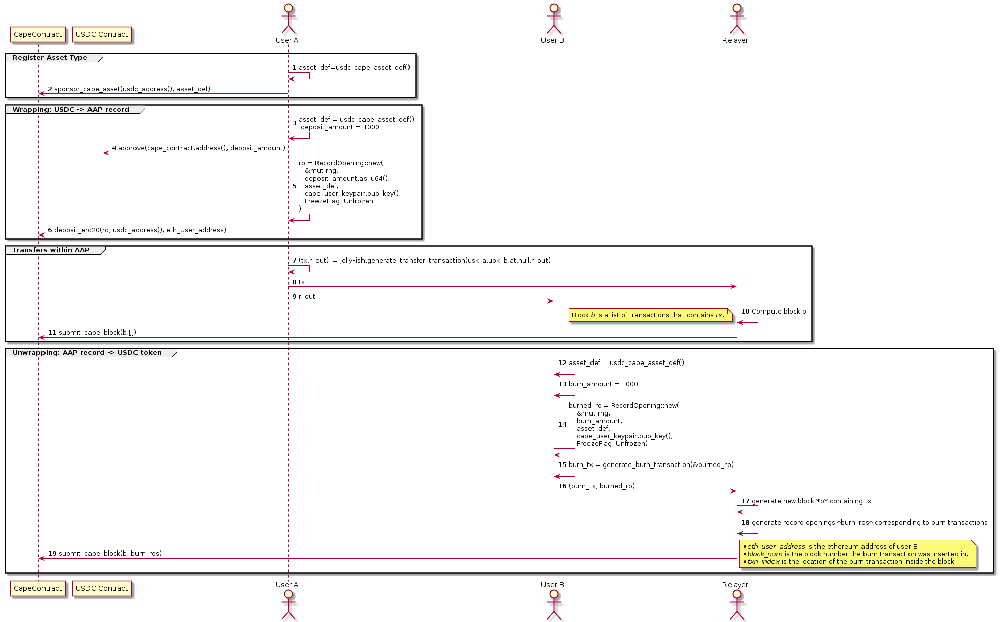

<!--
 ~ Copyright (c) 2022 Espresso Systems (espressosys.com)
 ~ This file is part of the Configurable Asset Privacy for Ethereum (CAPE) library.
 ~
 ~ This program is free software: you can redistribute it and/or modify it under the terms of the GNU General Public License as published by the Free Software Foundation, either version 3 of the License, or (at your option) any later version.
 ~ This program is distributed in the hope that it will be useful, but WITHOUT ANY WARRANTY; without even the implied warranty of MERCHANTABILITY or FITNESS FOR A PARTICULAR PURPOSE. See the GNU General Public License for more details.
 ~ You should have received a copy of the GNU General Public License along with this program. If not, see <https://www.gnu.org/licenses/>.
 -->

# Smart contracts

## CAPE Contract

The CAPE Smart contract allows bidirectional transfers of assets between Ethereum and the CAPE system. 
Its design is inspired by [Tornado Cash](https://tornado.cash/) where an ERC20 token transfer can trigger automatically the creation of some asset record inside the CAPE Blockchain. 
Transferring assets from CAPE to Ethereum relies on the idea of burning/destroying the asset record and unlock it on the other side (Ethereum) also in an atomic fashion.

### Interfaces

The CAPE contract has 4 public [interfaces](./CAPE.md): 
* `constructor` that is run only once when the contract is deployed.
* `sponsorCapeAsset` which allows to register a new asset type bound to an ERC20 token. 
* `depositErc20` allows to *wrap* ERC20 tokens into some asset records of a specific type that has already been registered earlier through `sponsorCapeAsset`.
* `submitCapeBlock` allows anyone to submit a block of CAPE transactions. If all the transactions in this block are valid then the state of the CAPE blockchain will be updated accordingly. If a transaction in the block is of type BURN, the asset records will be destroyed and the equivalent amount of ERC20 token will be sent to some specified ethereum address. This process is called *unwrapping*. 

### Sequence Diagram

In the sequence diagram above we describe how the CAPE contract can be used to wrap/unwrap ERC20 tokens and make transfers within the CAPE blockchain.

- **Sponsor asset type:**
  Before being able to wrap an ERC20 token into a CAPE asset record, it is necessary to create an asset type which will bind an ERC20 to an identifier and a CAPE policy. 
  This new asset type is created by some sponsor participant (user A in the diagram). 
   Once created it is provided to the CAPE contract which will store it along with the address of the corresponding ERC20 token.
- **Wrapping: USDC → CAPE asset record:**
  User A wraps his USDC tokens into some CAPE records using some asset type created in the previous phase.
- **Transfers within CAPE:**
  User A sends (part of) his assets to User B inside the CAPE blockchain.
- **CAPE asset record → USDC:**
  User B manages to unwrap his asset record received from User A by creating a special *BURN* transaction that will destroy this asset record but credit his (ethereum) address 
  with some USDC tokens. 
  These tokens are directly sent to the user as soon as the *BURN* transaction is processed.

## ERC20 contracts

The CAPE contract can interact with any ERC20 token available on Ethereum. 
In other words a token that implements the [ERC20 interface](https://eips.ethereum.org/EIPS/eip-20) can be wrapped into some CAPE asset record.